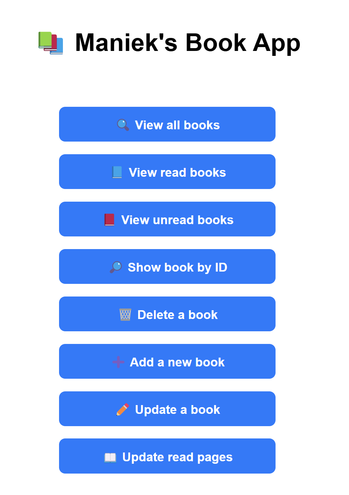
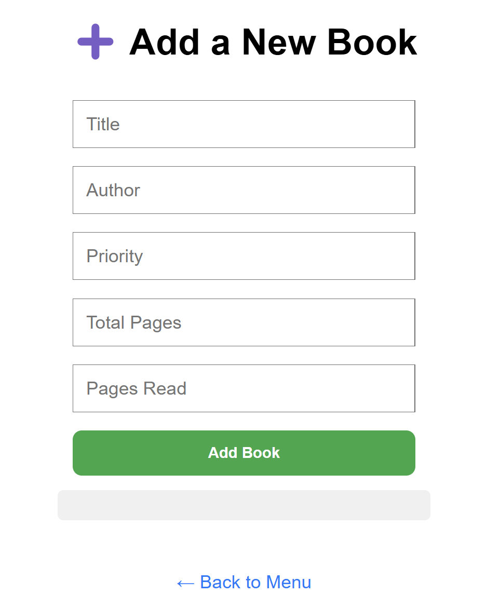
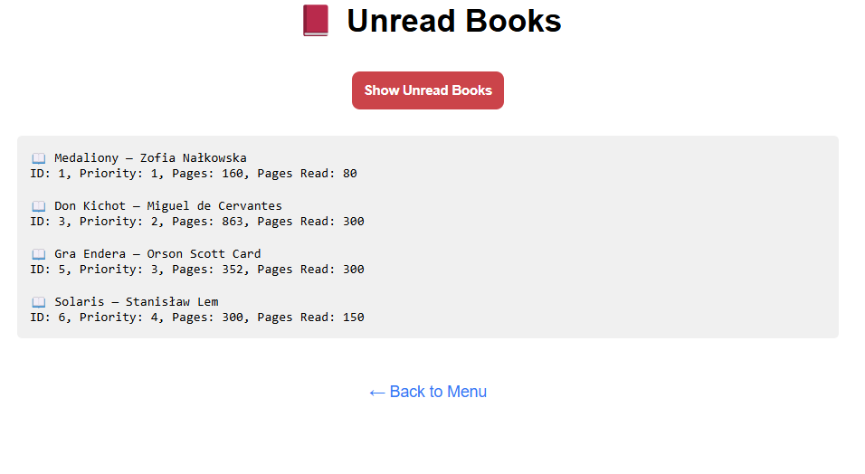

# ToReadApp
The application is created for people who want to track their progress in reading books.
It allows you to create your 'To Read' list, where you can prioritize which book is the most important for you and manage which books are next in the queue to read.
It also stores the books you have already read, so you can track how many books you have completed.
## 📌 Features of ToReadApp

🔍 View all books – browse the entire book collection

📘 View read books – see which books you've already read

📕 View unread books – check what's still on your reading list

🔎 Show book by ID – quickly find a specific book by its ID

🗑️ Delete a book – remove books you no longer need

➕ Add a new book – expand your library

✏️ Update a book – edit book details

📘 Update a progress – change the number of pages you've already read

## ⚙️ Application Setup & Running

> ⚠️ **Requirements**:  
> - Docker must be installed  
> - Ports `8000` (Frontend), `8080` (Backend) and `5432` (database) must be free  

## Application Set-up and Running
Before you begin, ensure that Docker is installed on your machine and that the following ports are available for use:

>Port 8000: Used by the frontend.

>Port 8080: Used by the backend.

>Port 5432: Used by the database.


### Build the Application
To build the application, use the following command:

```bash
docker compose up --build
```
### Running Application
Once the application is successfully built, you can run the image with:

```bash
docker compose up 
```
### Stopping Application
To stop the containers
```bash
docker compose down 
```

Once everything is set up and running, the application will be available at:
 http://localhost:8000.


## THINGS TO DO:
- Develop more tests
- Design a New Frontend

## Screenshots:







